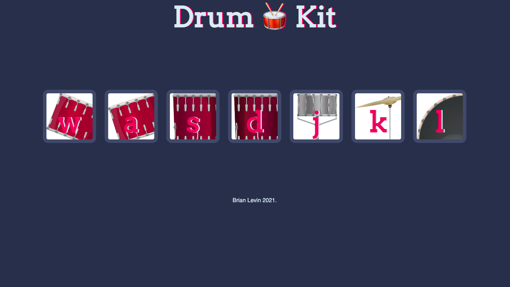

# Drum-Kit

 
 ## Application description:

A Javascript  application that lets the users  click with a mouse or a key  each button on the page. The buttons will  produce a differant sound depending on the button clicked. 
 

 ## Click [here]( https://brianlevin.github.io/Drum-Kit/) for the live app. 
 
 This is the home screen:
 
 
 
 These are differant sounds each button will make when clicked:
 

  
  

     
## Libraries and Frameworks:

- HTML
- CSS
- Javascript

## Email:

bml201095@gmail.com
